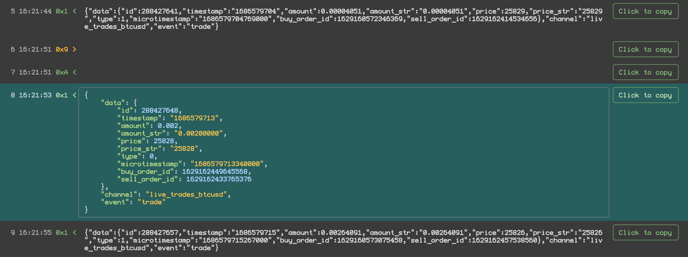
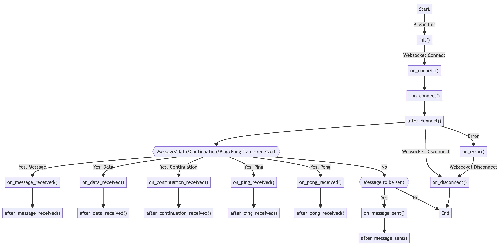

# `wsrepl` - Websocket REPL for pentesters

`wsrepl` is an interactive websocket REPL designed specifically for penetration testing. It provides an interface for observing incoming websocket messages and sending new ones, with an easy-to-use framework for automating this communication.



## Features

- Interactively send and receive websocket messages
- Customize headers, ping/pong messages, and other parameters
- Handle SSL verification and reconnections
- Plug-in support for automating complex interaction scenarios
- Full logging and message history
- Supports curl command line arguments for easy onboarding from Developer Tools or Burp Suite (use 'Copy as Curl' menu and replace `curl` with `wsrepl`)

## Installation

You can download and install wsrepl using pip:

```
pip install wsrepl
```

Alternatively, you can clone this repository and install it from source:

```
git clone https://github.com/doyensec/wsrepl
cd wsrepl
pip install .
```

## Usage

The basic command for starting wsrepl is as follows:

```
wsrepl -u URL
```

Replace URL with your target websocket URL, e.g. `wss://echo.websocket.org`. For more options and settings, you can use the -h or --help option:

```
usage: wsrepl [-h] [-u URL] [-i] [-s] [-k] [-X REQUEST] [-H HEADER] [-b COOKIE] [--compressed] [-S] [-A USER_AGENT]
              [-O ORIGIN] [-F HEADERS_FILE] [--no-native-ping] [--ping-interval PING_INTERVAL] [--hide-ping-pong]
              [--ping-0x1-interval PING_0X1_INTERVAL] [--ping-0x1-payload PING_0X1_PAYLOAD]
              [--pong-0x1-payload PONG_0X1_PAYLOAD] [--hide-0x1-ping-pong] [-t TTL] [-p HTTP_PROXY]
              [-r RECONNECT_INTERVAL] [-I INITIAL_MESSAGES] [-P PLUGIN] [--plugin-provided-url] [-v VERBOSE]
              [url_positional]

Websocket Client

positional arguments:
  url_positional        Websocket URL (e.g. wss://echo.websocket.org)

options:
  -h, --help            show this help message and exit
  -u URL, --url URL     Websocket URL (e.g. wss://echo.websocket.org)
  -i, --include         No effect, just for curl compatibility
  -s, --silent          No effect, just for curl compatibility
  -k, --insecure        Disable SSL verification
  -X REQUEST, --request REQUEST
                        No effect, just for curl compatibility
  -H HEADER, --header HEADER
                        Additional header (e.g. "X-Header: value"), can be used multiple times
  -b COOKIE, --cookie COOKIE
                        Cookie header (e.g. "name=value"), can be used multiple times
  --compressed          No effect, just for curl compatibility
  -S, --small           Smaller UI
  -A USER_AGENT, --user-agent USER_AGENT
                        User-Agent header
  -O ORIGIN, --origin ORIGIN
                        Origin header
  -F HEADERS_FILE, --headers-file HEADERS_FILE
                        Additional headers file (e.g. "headers.txt")
  --no-native-ping      Disable native ping/pong messages
  --ping-interval PING_INTERVAL
                        Ping interval (seconds)
  --hide-ping-pong      Hide ping/pong messages
  --ping-0x1-interval PING_0X1_INTERVAL
                        Fake ping (0x1 opcode) interval (seconds)
  --ping-0x1-payload PING_0X1_PAYLOAD
                        Fake ping (0x1 opcode) payload
  --pong-0x1-payload PONG_0X1_PAYLOAD
                        Fake pong (0x1 opcode) payload
  --hide-0x1-ping-pong  Hide fake ping/pong messages
  -t TTL, --ttl TTL     Heartbeet interval (seconds)
  -p HTTP_PROXY, --http-proxy HTTP_PROXY
                        HTTP Proxy Address (e.g. 127.0.0.1:8080)
  -r RECONNECT_INTERVAL, --reconnect-interval RECONNECT_INTERVAL
                        Reconnect interval (seconds, default: 2)
  -I INITIAL_MESSAGES, --initial-messages INITIAL_MESSAGES
                        Send the messages from this file on connect
  -P PLUGIN, --plugin PLUGIN
                        Plugin file to load
  --plugin-provided-url
                        Indicates if plugin provided dynamic url for websockets
  -v VERBOSE, --verbose VERBOSE
                        Verbosity level, 1-4 default: 3 (errors, warnings, info), 4 adds debug
```

## Automating with Plugins

To automate your websocket communication, you can create a Python plugin by extending the [Plugin](wsrepl/Plugin.py) class in wsrepl. This class allows you to define various hooks that are triggered during different stages of the websocket communication.

Here is an outline of how to define a plugin:

```python
class MyPlugin(Plugin):
    # Messages that will be sent to the server on (re-)connect.
    messages = ["message1", "message2", "message3"]

    def init(self):
        # This method is called when the plugin is loaded.
        # Use it to set initial settings or generate self.messages dynamically.
        pass

    async def on_connect(self):
        # This method is called when the websocket connection is established.
        pass

    async def on_message_received(self, message: WSMessage):
        # This method is called when a message is received from the server.
        pass

    # ... Other hooks can be defined here.
```

Refer to the source of [Plugin class](wsrepl/Plugin.py) for the full list of hooks you can use and what they do:



### Example Plugin

Here is an example of a plugin that sends a predefined authentication message to a server:

```python
from wsrepl import Plugin
import json

class AuthPlugin(Plugin):
    def init(self):
        auth_message = {
            "messageType": "auth",
            "auth": {
                "user": "user-1234"",
                "password": "password-1234"
            }
        }
        self.messages = [json.dumps(auth_message)]
```

This plugin can be used by specifying it when running wsrepl:

```
wsrepl -u URL -P auth_plugin.py
```

Replace URL with your target websocket URL and auth_plugin.py with the path to the Python file containing your plugin.

[docs/](./docs/) directory contains a few more example plugins.

## Contributing

Contributions to wsrepl are welcome! Please, [create an issue](https://github.com/doyensec/wsrepl/issues) or submit a pull request if you have any ideas or suggestions. In particular, adding more plugin examples would be very helpful.

## Credits

This project has been sponsored by [Doyensec LLC](https://www.doyensec.com/).


